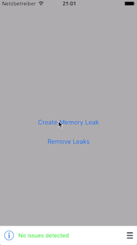
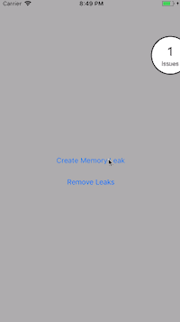

# LifetimeTracker

 
|  | |  |
|:--:| :--: | :--: |
| Bar style | | Circular style |

LifetimeTracker can surface retain cycle / memory issues right as you develop your application, and it will surface them to you immediately, so you can find them with more ease.

Instruments and Memory Graph Debugger are great, but too many times developers forget to check for issues as they close the feature implementation.

If you use those tools sporadicaly many of the issues they surface will require you to investigate the cause, and cost you a lot of time in the process.

Other tools like [FBRetainCycleDetector](https://github.com/facebook/FBRetainCycleDetector) rely on objc runtime magic to find the problems, but that means they can't really be used for pure Swift classes. This small tool simply focuses on tracking lifetime of objects which means that it can be used in both Objective-C and Swift codebases and it doesn't rely on any complex or automatic magic behaviour.

## Installation

### CocoaPods

Add `pod 'LifetimeTracker'` to your Podfile.

### Carthage

Add `github "krzysztofzablocki/LifetimeTracker"` to your Cartfile.

## Integration

To Integrate visual notifications simply add following line at the start of `AppDelegate(didFinishLaunchingWithOptions:)`.

Swift:

```swift
#if DEBUG
	LifetimeTracker.setup(onUpdate: LifetimeTrackerDashboardIntegration(visibility: .alwaysVisible, style: .bar).refreshUI)
#endif
```

Objective-C:

```objc
LifetimeTrackerDashboardIntegration *dashboardIntegration = [LifetimeTrackerDashboardIntegration new];
[dashboardIntegration setVisibleWhenIssueDetected];
[dashboardIntegration useBarStyle];
[LifetimeTracker setupOnUpdate:^(NSDictionary<NSString *,EntriesGroup *> * groups) {
    [dashboardIntegration refreshUIWithTrackedGroups: groups];
}];
```

You can control when the dashboard is visible: `alwaysVisible`, `alwaysHidden`, or `visibleWithIssuesDetected`.

There are two styles available. A overlay bar view which shows the detailed list of issues directly on the screen or a circular view which displays only the amount of issues and opens the detailed list as modal view controller.

## Tracking key actors

Usually you want to use LifetimeTracker to track only key actors in your app, like ViewModels / Controllers etc. When you have more than `maxCount` items alive, the tracker will let you know.

### Swift

You conform to `LifetimeTrackable` and call `trackLifetime()` at the end of your init functions:

```swift
class SectionFrontViewController: UIViewController, LifetimeTrackable {
    static var lifetimeConfiguration = LifetimeConfiguration(maxCount: 1, groupName: "VC")

    override init(nibName nibNameOrNil: String?, bundle nibBundleOrNil: Bundle?) {
        super.init(nibName: nibNameOrNil, bundle: nibBundleOrNil)
        /// ...
        trackLifetime()
    }
}
```

### Objective-C

You conform to `LifetimeTrackable` and call `[self trackLifetime]` at the end of your init functions:

```objc
@import LifetimeTracker;

@interface SectionFrontViewController() <LifetimeTrackable>

@implementation SectionFrontViewController

+(LifetimeConfiguration *)lifetimeConfiguration
{
    return [[LifetimeConfiguration alloc] initWithMaxCount:1 groupName:@"VC"];
}

- (instancetype)initWithNibName:(NSString *)nibNameOrNil bundle:(NSBundle *)nibBundleOrNil
{
    self = [super initWithNibName:nibNameOrNil bundle:nibBundleOrNil];
    if (self) {
    	/// …
        [self trackLifetime];
    }
    return self;
}
@end
```

## Integrating with [Danger](https://danger.systems)

If you are using Danger, you can use it to add both checkbox to each PR to ensure people have verified no retain cycles were created but also to inform you when someone forgets to call `trackLifetime()` function.

```ruby
# 
# ** FILE CHECKS **
# Checks for certain rules and warns if needed.
# Some rules can be disabled by using // danger:disable rule_name
# 
# Rules:
# - Check if the modified file is a View and doesn't implement LifetimeTrackable (lifetime_tracking)

# Sometimes an added file is also counted as modified. We want the files to be checked only once. 
files_to_check = (git.modified_files + git.added_files).uniq
(files_to_check - %w(Dangerfile)).each do |file|
	next unless File.file?(file)
	# Only check inside swift files
  next unless File.extname(file).include?(".swift")
    	
  # Will be used to check if we're inside a comment block.
	is_comment_block = false

	# Collects all disabled rules for this file.
	disabled_rules = []

	filelines = File.readlines(file)
	filelines.each_with_index do |line, index|
		if is_comment_block
			if line.include?("*/")
				is_comment_block = false
			end
		elsif line.include?("/*")
			is_comment_block = true
		elsif line.include?("danger:disable")
			rule_to_disable = line.split.last
			disabled_rules.push(rule_to_disable)
		else
			# Start our custom line checks
			# e.g. you could do something like check for methods that only call the super class' method
			#if line.include?("override") and line.include?("func") and filelines[index+1].include?("super") and filelines[index+2].include?("}")
			#	warn("Override methods which only call super can be removed", file: file, line: index+3) 
			#end
    end
	end
	
	# Only continue checks for Lifetime Trackable types
	next unless (File.basename(file).include?("ViewModel") or File.basename(file).include?("ViewController") or File.basename(file).include?("View.swift")) and !File.basename(file).include?("Node") and !File.basename(file).include?("Tests") and !File.basename(file).include?("FlowCoordinator")

	if disabled_rules.include?("lifetime_tracking") == false 
		if File.readlines(file).grep(/LifetimeTrackable/).any? 
			fail("You forgot to call trackLifetime() from your initializers in " + File.basename(file, ".*") + " (lifetime_tracking)") unless File.readlines(file).grep(/trackLifetime()/).any? 
		else
			warn("Please add support for LifetimeTrackable to " + File.basename(file, ".*") + " . (lifetime_tracking)")
		end
		markdown("- [ ] I've verified that showing and hiding " + File.basename(file, ".*") + " doesn't surface any [LifetimeTracker](https://github.com/krzysztofzablocki/LifetimeTracker) issues")
	end

end
```


## Group tracked objects

You can group tracked objects together. `maxCount` of a group will be calculated by `maxCount` of all members per default. However, you can override it and provide a separate value to the group with `groupMaxCount`.

You may want to do this when you have a set of sublasses which can appear x times each, but in total only less than the sum of all sublcasses:

```swift
// DetailPage: UIViewController

// VideoDetailPage: DetailItem
LifetimeConfiguration(maxCount: 3, groupName: "Detail Page")

// ImageDetailPage: DetailItem
LifetimeConfiguration(maxCount: 3, groupName: "Detail Page")

=> Group warning if 7 DetailPage objects are alive

// VideoDetailPage: DetailItem
LifetimeConfiguration(maxCount: 3, groupName: "Detail Page", groupMaxCount: 3)

// ImageDetailPage: DetailItem
LifetimeConfiguration(maxCount: 3, groupName: "Detail Page", groupMaxCount: 3)

=> Group warning if 4 DetailPage object are alive

```

## Writing integration tests for memory leaks

You can access the summary label using accessibility identifier `LifetimeTracker.summaryLabel`, which allows you to write integration tests that end up with looking up whether any issues were found.

## License 
LifetimeTracker is available under the MIT license. See [LICENSE](LICENSE) for more information.

## Attributions

I've used [SwiftPlate](https://github.com/JohnSundell/SwiftPlate) to generate xcodeproj compatible with CocoaPods and Carthage.
